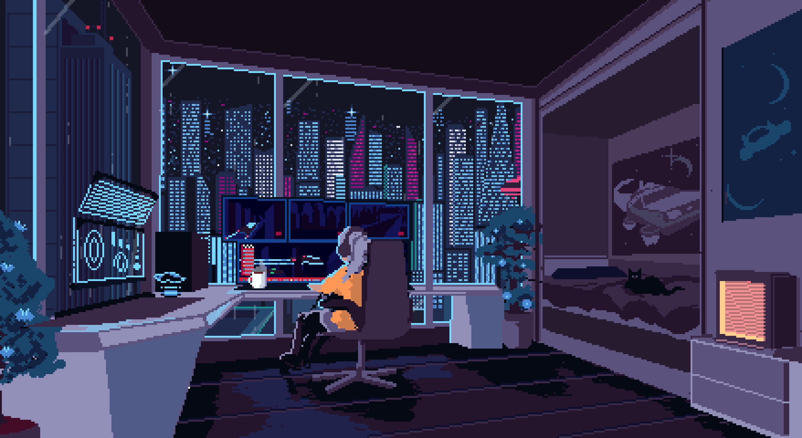

 

I'm a Software Engineering student and currently taking a Python programming course at SENAI. I'm also delving deeper into data analysis
with SQL and studying English to expand my professional
opportunities. In my free time, I enjoy learning Korean as a hobby, as well as
drawing and reading. 

  

  
  

  

  
  
 
  
  
  
  
  
  
  
  

<picture align="center">
  <source media="(prefers-color-scheme: dark)" srcset="https://raw.githubusercontent.com/kellcrist1/kellcrist1/output/github-contribution-grid-snake-dark.svg">
  <source media="(prefers-color-scheme: light)" srcset="https://raw.githubusercontent.com/kellcrist1/kellcrist1/output/github-contribution-grid-snake-dark.svg">
  
</picture>
